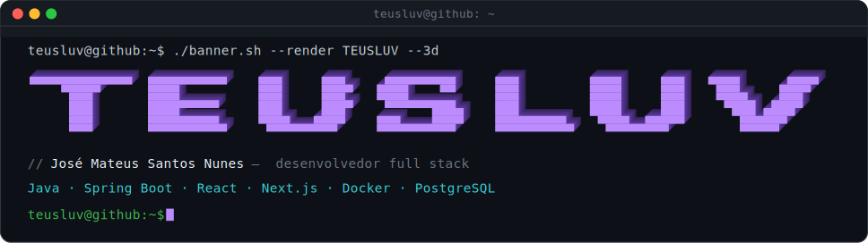
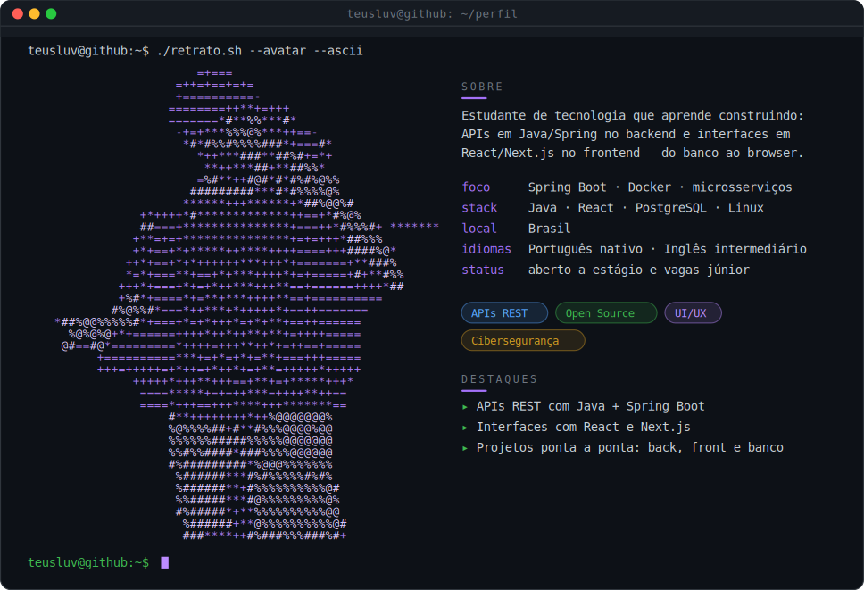
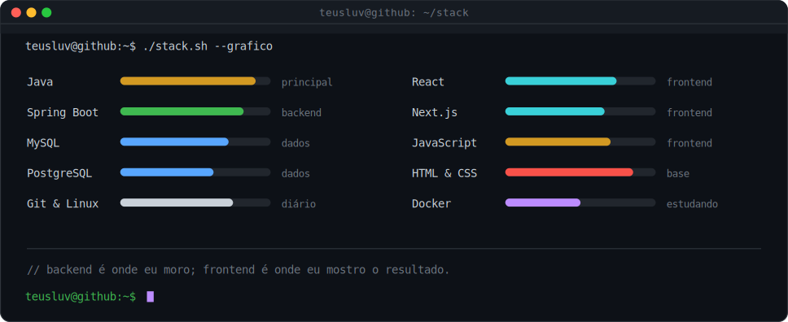

  <!-- BANNER PRINCIPAL TEUSLUV -->
  

    

  <!-- BADGES DE STATUS E VISITAS -->
  
  
  

 

---

### 👤 Sobre mim

  

 

---

### 💻 Stack & Tecnologias

  

 

  

 

---

### 📊 GitHub em números

  
  

 

  

 

---

### 📬 Contato & Conexões

  
  

