  

  
  
  
  

---

## 👤 Sobre mim

  

- 🎓 Estudante de tecnologia que aprende **construindo** — projeto de ponta a ponta, do banco ao browser
- 💼 **Backend:** APIs REST com **Java** e **Spring Boot**, persistência com JPA/Hibernate
- 🎨 **Frontend:** interfaces com **React**, **Next.js** e **Tailwind CSS**
- 🌱 **Estudando agora:** Docker, Kubernetes, microsserviços e boas práticas de testes
- 🗣️ **Idiomas:** Português (nativo) · Inglês (intermediário)
- 📫 **Aberto a** estágio, vagas júnior e colaborações em open source

---

## 🧰 Stack

  

  
   
  

---

## 📊 GitHub em números

  
  

  

---

## 🚀 Projetos em destaque

  
  

  
  

| Projeto | O que é | Stack |
| :--- | :--- | :--- |
| [**FluxoHub.Beta**](https://github.com/teusluv/FluxoHub.Beta) | Versão beta da plataforma FluxoHub | `Java` `Spring Boot` |
| [**fluxohubE-commerce**](https://github.com/teusluv/fluxohubE-commerce) | E-commerce do ecossistema FluxoHub | `Full Stack` |
| [**Api_EventosTec**](https://github.com/teusluv/Api_EventosTec) · [front](https://github.com/teusluv/Eventos-Tec) | API + interface para gestão de eventos de tecnologia | `Spring Boot` `REST` |
| [**Api_ControleFinaceiro**](https://github.com/teusluv/Api_ControleFinaceiro) | API de controle financeiro pessoal | `Java` `Spring Boot` |
| [**meu-portfolio**](https://github.com/teusluv/meu-portfolio) | Meu portfólio pessoal | `React` `Next.js` |
| [**busca-grafos-a3**](https://github.com/teusluv/busca-grafos-a3) | Algoritmos de busca em grafos (acadêmico) | `Java` `Algoritmos` |
| [**Java-Curso**](https://github.com/teusluv/Java-Curso) | Estudos e exercícios de Java | `Java` |

> Todos os projetos em **[github.com/teusluv?tab=repositories](https://github.com/teusluv?tab=repositories)**

---

## 📈 Atividade

  

---

## 🌐 Contato

  
  
  

  Os cartões em <code>assets/</code> são gerados por <a href="tools/gen_assets.py"><code>tools/gen_assets.py</code></a> — o retrato em ASCII vem do meu próprio avatar.

